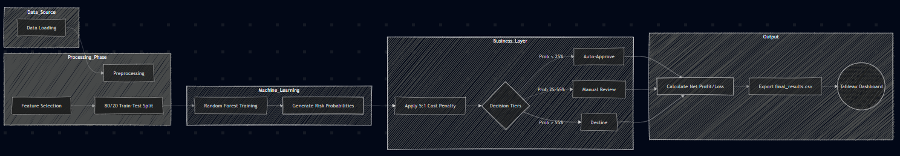

# Credit Risk Decision Engine
**Transforming borrower data into smarter lending decisions.**

---
## The Business Challenge

Every lender faces the same balancing act:
- **Revenue:** Approve good customers who pay back with interest
- **Risk:** Avoid bad customers who default on loans

**The math is simple:** Rejecting a good customer costs us lost interest income, but approving a bad customer costs us the entire loan amount.

**Solution:** A data-driven Decision Engine that calculates a Risk Score for every applicant — replacing guesswork with precision to protect the bank's capital.


## Project Structure
``` text
credit-risk-engine/
├── data/|── raw
|        |── processed # Final CSV results ready for Tableau dashboards
├── notebooks/ # Python code for cleaning, training, and profit analysis
├── tableau/ 
└── README.md 
```

## Project WorkFlow



---

## Decision Framework

Based on the Probability of default a Risk abands are generated with specific actions:

| Risk Level | Probability | Business Action |
|------------|-------------|-----------------|
| Low | < 25% | **Auto-Approve** - *Fast-track for reliable customers* |
| Medium | 25% – 55% | **Manual Review** - *Escalate to loan officer* |
| High | > 55% | **Decline** - *Protect bank capital* |


## Business Impact

| Metric | Outcome |
|--------|---------|
| **Efficiency** | +60% more applications processed by automating low-risk approvals |
| **Profitability** | 5:1 risk penalty ensures model prioritizes loss prevention |
| **Transparency** | Every decision is traceable in Tableau with full audit trail |


